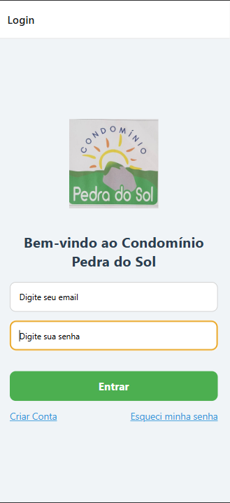
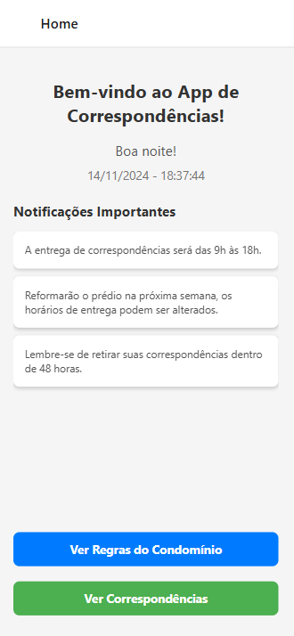
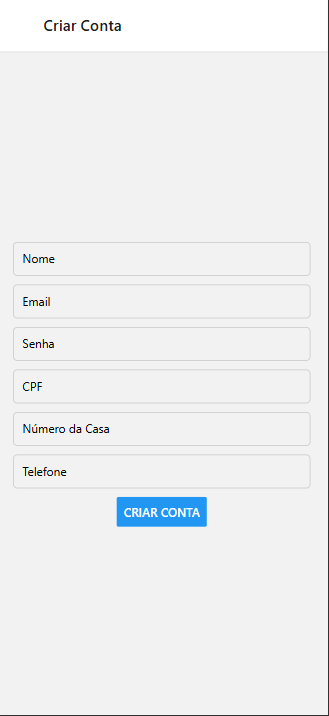

# Controle Correspondências - Condomínio Pedra do Sol 🏠📦

O **Controle Correspondências** é um aplicativo mobile desenvolvido para gerenciar o recebimento e a entrega de correspondências no **Condomínio Pedra do Sol**. Ele permite que os moradores possam acompanhar suas correspondências, saber o que chegou na portaria, e facilitar a comunicação com a administração do condomínio.

## Funcionalidades 📱

- **Tela de Login 🔑:** Os moradores podem fazer login utilizando seu email e senha para acessar o sistema.
- **Tela de Criação de Conta 📝:** Permite que novos moradores se cadastrem, informando dados pessoais como nome, email, CPF, data de nascimento, e outros detalhes essenciais.
- **Tela de Correspondências 📦:** Após o login, o morador pode visualizar suas correspondências, sejam elas pacotes, cartas ou outros itens.
- **Home 🏠:** A tela inicial do aplicativo oferece uma visão geral com boas-vindas, data/hora atual, e notificações importantes sobre o condomínio, incluindo regras de recebimento e retirada de mercadorias.
- **Cadastro e Acompanhamento de Correspondências 📤:** O morador pode adicionar novas correspondências, como pacotes, e marcar se já foram retiradas ou não.

## Tecnologias Utilizadas 🛠️

O aplicativo foi desenvolvido utilizando as seguintes tecnologias:

- **React Native:** Framework para construção de aplicativos móveis usando JavaScript. 📱
- **Expo:** Utilizado para facilitar o desenvolvimento com React Native, proporcionando um ambiente simplificado para compilar e testar o app. ⚡
- **React Navigation:** Biblioteca para navegação entre telas dentro do aplicativo. 🚀
- **React Native Paper:** Biblioteca para componentes de UI (Interface do Usuário) com uma aparência moderna e consistente. 🎨
- **Hooks e Context API:** Para gerenciar estado dentro do app, garantindo uma navegação fluida e comunicação entre componentes. 🔄

## Instalação ⚙️

### Requisitos

Antes de rodar o aplicativo, você precisa ter o seguinte instalado:

- **Node.js** - Para rodar o backend e gerenciar pacotes com `npm`. 🌐
- **Expo CLI** - Para compilar e testar o app. 📲

### Passos para Instalação

1. Clone o repositório:
   ```bash
   git clone https://github.com/Acmqueiroz/app-correspondencias.git


## Telas do Aplicativo

### Tela de Login


### Tela Home


### Tela Criar Conta

